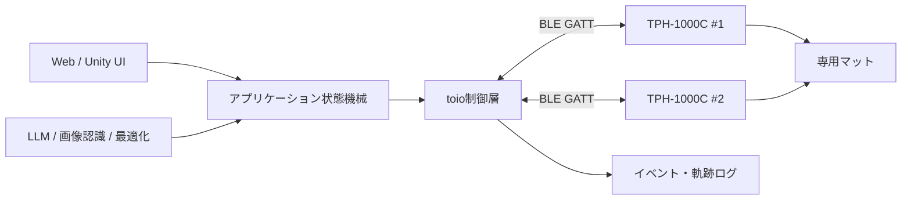

# toio コア キューブ開発者向け調査メモ

調査日: 2026-07-25  
対象機種: **TPH-1000C（toio コア キューブ単体）**

## 1. 結論

toio コア キューブは、32 mm幅の小型二輪ロボットをBluetooth Low Energy（BLE）で制御するプラットフォームである。最大の特徴は、専用マット上でキューブ自身が絶対位置と角度を取得し、指定座標までの移動をキューブ側で実行できる点にある。

ハッカソンでは、次の構成が最短で成果につながりやすい。

- **Windows PC + Python + `toio.py` + 付属の簡易プレイマット**
- PC側でAI、ゲームロジック、画面表示を担当
- キューブ側の「目標指定付きモーター制御」を利用して移動を安定化
- 位置、姿勢、衝突、タップなどをイベントとして扱う

toioの価値は単なるラジコン操作ではなく、**デジタル情報を物理空間で動かし、人が手で介入できること**にある。企画では「自動で動く」だけでなく、人がつまむ、置く、叩く、向きを変えるといった身体的な操作を体験の中心にすると、toioを使う必然性が出る。

## 2. 配布機種 TPH-1000C について

`TPH-1000C` は、公式製品名では「toio コア キューブ（単体）」に該当する。公式サイトに記載された品番は `TPH-1000C 010`。

通常の製品パッケージには次が含まれる。

- toio コア キューブ x 1
- トッププレート（白）x 1
- 簡易プレイマット x 1
- 簡易カード x 1

重要な注意点:

- toioコンソールやtoioリングは、PCからBLEで直接開発する場合には不要。
- 市販の単体版は、**充電に別売の専用充電器が必要**。配布物に充電器が含まれるかを最初に確認する。
- 現行の専用充電器は `TPH-ZCC2J10`。USB Type-A - Type-Cケーブルが付属するが、キューブ本体にUSBケーブルを直接挿す構造ではない。
- 付属マットを紛失すると、絶対位置を使うデモの再現性が大きく下がる。
- 複数台を使う場合、底面やBLE名の末尾3文字を記録し、機体を識別できるようにする。

公式希望小売価格は、調査時点でキューブ単体が7,128円（税込）、専用充電器が5,478円（税込）。今回は配布機なので、追加調達よりも充電器とマットの確保を優先する。

## 3. 何ができるか

### 3.1 入力（センサー）

| 機能 | 得られる情報 | 開発上の用途 |
| --- | --- | --- |
| 読み取りセンサー | 専用マット上のX/Y座標、角度 | 自律移動、ゲーム盤、軌跡、領域判定 |
| Standard ID | カード固有ID、カードに対する角度 | コマンドカード、アイテム認識、状態切替 |
| 6軸モーション | 水平、衝突、ダブルタップ、6方向の姿勢、シェイク強度 | 物理ジェスチャー、衝突ゲーム、持ち上げ検知 |
| 姿勢角 | Roll/Pitch/Yaw、クォータニオン、高精度オイラー角 | 傾き入力、デジタルツイン |
| 磁気センサー | 定義済み磁石パターン、磁力強度、3軸方向 | 着脱パーツ認識、磁石を使った入力 |
| モーター速度 | 左右車輪の速度 | 動作監視、スタック推定 |
| 機能ボタン | 押下・解放 | モード切替、決定操作 |
| バッテリー | 0〜100%を10%刻み | デモ前点検、低電力警告 |

注意:

- 衝突センサーは距離センサーではない。障害物に接触する前の検知はできない。
- 姿勢角のYawは絶対方位ではなく、時間と動作に応じてドリフトする。公式仕様には、静止中でも数秒に約1度、1回転で数度ずれる例が示されている。
- 磁気センサー、姿勢角通知、モーター速度通知はデフォルト無効の機能があるため、接続後に設定が必要。

### 3.2 出力（アクチュエーター）

| 機能 | 内容 |
| --- | --- |
| 左右モーター | 前進・後退・旋回、時間指定、加速度指定 |
| 目標移動 | 専用マット上の目標X/Y座標と角度まで自律移動 |
| 複数目標移動 | 最大29地点を順番に移動 |
| RGBランプ | 色、点灯時間、最大29ステップのパターン、なめらかな点滅 |
| サウンド | 11種類の内蔵効果音、MIDIノート列（最大59ステップ） |

モーターの主な公式値:

- 最高直進速度: 350 mm/s（無積載、水平面）
- 最高回転速度: 1500度/s（無積載、水平面）
- 最大積載重量: 200 g。ただし重心次第で200 g未満でも正常走行しない
- モーター速度指示値: 0〜255
- 実際に回転速度が変化する有効範囲: 8〜115
- 時間指定: 10 ms単位、最大2.55秒（1命令あたり）

目標移動は、位置差が15以内、角度差が4度以内になると到達扱いになる。ここでいうマット座標の単位はmmではないため、画面座標や実寸との変換を決めつけないこと。

## 4. 専用マットと座標系

### 4.1 Position ID

専用マットには肉眼では目立ちにくいパターンが印刷されており、底面センサーが次を読み取る。

- キューブ中心のX/Y座標
- キューブ中心の角度（0〜360度、X軸方向が0度、時計回りが正）
- 読み取りセンサー位置のX/Y座標と角度

TPH-1000C付属の簡易プレイマットで取得できる公式座標範囲は次のとおり。

- X: 98〜402
- Y: 142〜358

これは印刷された座標値であり、物理的なmm値ではない。目標位置は、この範囲からキューブ半径と停止誤差を考慮して内側に設定する。

### 4.2 Standard ID

簡易カードなどには、位置ではなく固有値を返すStandard IDが印刷されている。カード上でのキューブ角度も取得できる。

向いている用途:

- カードを「目的地」「役割」「アイテム」「命令」として扱う
- キューブをカードに置くことでモードを切り替える
- カード上で回してパラメーターを調整する

### 4.3 マットなしの場合

マットがなくても、左右モーター、姿勢、衝突、タップ、LED、音は利用できる。ただし絶対位置と目標座標移動は使えない。車輪速度やIMUだけで長時間の位置を推定すると誤差が蓄積するため、ハッカソンではマットありを基本にする。

## 5. 通信仕様

- Bluetooth 4.2準拠のBLEペリフェラル
- GATTのPrimary Service UUID: `10B20100-5B3B-4571-9508-CF3EFCD7BBAE`
- 広告上のShortened Local Name: `toio-XXX`
- `XXX` は機体ごとの3文字。ただし世界で一意である保証はない
- 位置、センサー、ボタン、バッテリー、モーター応答はNotifyでイベント受信可能
- モーター、LED、音、設定はGATT Characteristicへの書き込みで制御

主要Characteristic:

| 対象 | UUID末尾 | 操作 |
| --- | --- | --- |
| ID情報 | `0101` | Read / Notify |
| モーター | `0102` | Write without response / Read / Notify |
| ランプ | `0103` | Write |
| サウンド | `0104` | Write |
| センサー | `0106` | Write / Read / Notify |
| ボタン | `0107` | Read / Notify |
| バッテリー | `0108` | Read / Notify |
| 設定 | `01FF` | Write / Read / Notify |

UUIDの共通サフィックスは `-5B3B-4571-9508-CF3EFCD7BBAE`。

ID通知は最小10 msに設定できるが、これは保証周期ではない。OS、BLEアダプター、接続台数、処理負荷で変動する。複数台制御では、PC側で高頻度にモーター命令を送り続けるより、キューブ側の目標移動やシーケンスを活用するほうが通信負荷に強い。

## 6. システムソフトウェアと互換性

調査時点の最新技術仕様はBLEプロトコル **v2.5.0**。対応するキューブのシステムソフトウェアは **v02.0007**。

| システムソフトウェア | BLEプロトコル |
| --- | --- |
| v02.0005 | v2.3.0 |
| v02.0006 | v2.4.0 |
| v02.0007 | v2.5.0 |

v2.4.0ではBLE広告名の仕様に後方互換性のない変更がある。古いコードが `toio Core Cube-XXX` だけを検索していると、新しいキューブの `toio-XXX` を発見できない可能性がある。

v2.5.0では、リモート電源オフ、保存可能な設定、なめらかなLED点滅などが追加された。使用するSDKがv2.4.0までの対応でも基本機能は利用できるが、v2.5.0固有機能はラッパーAPIが未対応の可能性がある。

ハッカソン初日に全機体で次を実施する。

1. 公式アップデート案内に従い、システムソフトウェアを確認する。
2. 使用SDKからBLEプロトコルバージョンを読み取る。
3. チーム内の機体バージョンを揃える。
4. 新機能が不要なら、v2.4互換の基本APIだけで実装する。

## 7. 開発環境の選び方

### 7.1 推奨: Python / toio.py

短期間のプロトタイプ、AI連携、データ処理には最も扱いやすい。

- パッケージ名: `toio-py`
- Python 3.8以上、公式READMEではPython 3.12推奨
- BLE通信は`bleak`を利用
- Windows、Linux、macOS対応。iOS/iPadOSは実験的対応
- 非同期の低レベルAPI `ToioCoreCube`
- 同期的で簡単な `SimpleCube`
- 複数台用の `MultipleToioCoreCubes`
- WindowsではOSに登録済みのキューブを検索可能
- toio.py 1.1.0はBLE仕様v2.4.0ベース

最小スモークテスト例:

```python
import asyncio

from toio import ToioCoreCube


async def main() -> None:
    async with ToioCoreCube() as cube:
        await cube.api.motor.motor_control(30, 30)
        await asyncio.sleep(0.5)
        await cube.api.motor.motor_control(0, 0)


if __name__ == "__main__":
    asyncio.run(main())
```

実案件では、接続・切断、目標移動の完了応答、`toio ID missed`、タイムアウトを状態機械として扱う。

### 7.2 Unity / toio SDK for Unity

画面演出、ゲーム、AR、複数台の衝突回避が重要なら有力。

- 最新公開リリース: v1.6.0（2024-09）
- Unity 2022.3.44f1 LTS
- BLEプロトコルv2.4.0対応
- Windows 10 64 bit、macOS 11以上、iOS 12以上、Android 9以上
- 実機とシミュレーターを同じコードで制御
- 複数マット、Standard IDをシミュレーターに配置可能
- Navigatorによる衝突回避、群制御、ボイド
- Visual Scripting対応
- MIT License

物理デモと画面上のデジタルツインを同時に見せる場合、Unity版の見栄えとシミュレーション機能は強い。一方、Unity未経験チームには環境構築コストが大きい。

### 7.3 toio Do

Scratch 3.0形式のビジュアルプログラミング環境。ブラウザー版、iPadアプリ、Chromebookアプリがある。2025年にv1.6の更新案内があり、現在も公式導線が維持されている。

向いている用途:

- 数時間で動きを試す
- 非エンジニアを含むチームでロジックを共有する
- センサーやマットの挙動を確認する
- 子ども向け・教育向け企画

複雑な外部API、AI、データ永続化との統合はPythonやUnityのほうが組みやすい。

### 7.4 toio.js

公式のNode.js/TypeScriptライブラリだが、ハッカソンの第一候補にはしにくい。

- Node.js 10以上を前提とする古い構成
- BLEに`noble`を利用
- Windowsでは追加ドライバー、C++、Python、Bluetooth 4.0 USBアダプターを求めるREADME記載がある
- 主要コードと導入説明が現在のNode.js/Windows環境に対して古い

既存資産がある場合以外は、PythonまたはUnityを優先する。Web UIが必要なら、PythonバックエンドからWebSocket等でブラウザーへ状態を配信する構成が堅実。

### 7.5 BLE仕様を直接実装

公式GATT仕様が公開されているため、Swift、Kotlin、Rustなどから直接実装できる。ただし、バイト列、リトルエンディアン、Notify購読、プロトコルバージョン差分を自分で管理する必要がある。ハッカソンでは、既存SDKにないv2.5機能が企画の核になる場合だけ検討する。

## 8. 推奨アーキテクチャ



制御層では、SDKのオブジェクトをUIやAIロジックへ直接露出させず、次のような操作へ絞る。

- `connect(cube_id)`
- `move_to(x, y, angle)`
- `stop()`
- `set_light(color)`
- `play_sound(pattern)`
- `on_position(callback)`
- `on_gesture(callback)`

アプリケーション状態は最低限、`DISCONNECTED`、`READY`、`MOVING`、`ARRIVED`、`OFF_MAT`、`ERROR` を持たせる。デモ中のBLE切断やマット外への脱落を「例外」ではなく通常の状態として設計する。

## 9. ハッカソン向け企画案

### A. AIファシリテーター付きフィジカル会議盤

複数のキューブを議題、意見、優先度としてマット上で動かす。参加者がキューブを手で移動すると、AIが発言や投票を要約し、論点の近さに応じて再配置する。

- toioらしさ: 人とAIが同じ物体を交互に操作する
- 技術要素: LLM、位置イベント、クラスタリング、複数台移動
- MVP: 2台、3領域、音声入力なしでテキスト議題のみ

### B. 災害物流・避難計画のデジタルツイン

地図を模したマット上で、キューブを救援車・物資・避難者として動かす。条件を変更すると最適化結果を物理的に再現し、人がキューブを動かして制約を追加できる。

- toioらしさ: 最適化結果が物理空間で理解できる
- 技術要素: 経路探索、制約最適化、UnityまたはWeb可視化
- MVP: 固定グリッド、1〜2台、障害領域はUIから指定

### C. 手で教えるロボット行動学習

ユーザーがキューブを手で動かした軌跡を記録し、別のキューブが模倣する。ジェスチャーやカードで「速く」「慎重に」「逆向き」などのスタイルを付与する。

- toioらしさ: Programming by Demonstrationを直感的に見せられる
- 技術要素: 軌跡平滑化、再サンプリング、複数目標移動
- MVP: 記録、再生、速度切替の3機能

### D. 視覚に頼らないタンジブル・ナビゲーション

音、振動代わりのモーター動作、物理的な移動を使い、机上の情報を触って探索するインターフェース。キューブがユーザーの手元へ移動し、向きや音で選択肢を示す。

- toioらしさ: 画面外のアクセシブルな情報提示
- 技術要素: 音パターン、位置制御、タップ・姿勢入力
- 注意: 当事者評価なしにアクセシビリティ効果を断定しない

### E. 生きたデータ・ダッシュボード

キューブをサービスやエージェントに見立て、障害、負荷、進捗を位置・色・動きで表現する。キューブをカードへ置くと再起動、担当割当、優先度変更などを実行する。

- toioらしさ: 監視と操作が同じ物体に統合される
- 技術要素: API連携、イベント処理、Standard ID
- MVP: モックデータ3状態、キューブ1〜2台

最も実装リスクが低く、toioの独自性を出しやすいのは **C: 手で教える行動学習**。AIテーマとの接続が必要なら、軌跡の分類や自然言語による動作変換を追加する。見栄えを優先するなら **A** または **B** が強い。

## 10. 実装上のリスクと対策

| リスク | 対策 |
| --- | --- |
| 充電器がない | 配布時に専用充電器を確認。チーム間共有なら充電時間割を作る |
| BLE接続が不安定 | 機体IDを固定、再接続を実装、不要なBluetooth機器を減らす |
| SDKとファームの差 | 基本機能はv2.4互換APIに限定し、v2.5固有機能は事前検証 |
| マット外へ出る | 端から余白を取る、速度を抑える、`ID missed`で即停止 |
| 複数台が衝突 | 経路を時間分割するか、Unity Navigatorを利用 |
| 装飾で走行が悪化 | 軽く、低重心にし、底面センサーと車輪を塞がない |
| 底面LEDが見えない | 半透明マット、反射、上部の造形など見せ方を事前確認 |
| 高頻度通知で処理詰まり | 最新値だけを保持し、描画・AI処理とBLE受信を分離 |
| デモPC固有の問題 | 本番と同じPC、OS、BLEアダプターで通しテスト |
| AI応答待ちで停止して見える | LED・音・小さな待機動作で状態を表現 |

安全面では、卓上の縁から十分離し、マットを固定する。最大速度でのデモは避け、緊急停止操作を画面とキーボードの両方に用意する。

## 11. 最初の60分で確認すること

1. 配布物にキューブ、トッププレート、簡易マット、簡易カード、専用充電器があるか確認。
2. 機体のBLE名 `toio-XXX` を記録。
3. バッテリーを確認し、必要なら充電。
4. システムソフトウェアとBLEプロトコルバージョンを確認。
5. `toio.py`またはUnity SDKで1台に接続。
6. 低速で0.5秒前進し、停止できることを確認。
7. マット上のX/Y/角度通知を表示。
8. 目標座標へ移動し、正常終了応答を確認。
9. キューブを持ち上げ、`Position ID missed`を確認。
10. 2台使う場合は同時接続と緊急停止を確認。

この段階を通過するまで、AIや画面演出の実装を始めない。最初に「接続・位置・移動・停止」の縦切りを完成させる。

## 12. 推奨する技術選定

今回のTPH-1000Cを使うハッカソンでは、次を初期案とする。

| レイヤー | 推奨 |
| --- | --- |
| キューブ制御 | Python 3.12 + `toio-py` |
| 非同期処理 | `asyncio` |
| UI | FastAPI + WebSocket + 任意の軽量Web UI |
| AI | 外部APIまたはローカルモデルを制御層から分離 |
| 状態管理 | 明示的な状態機械 |
| ログ | 時刻、cube ID、位置、角度、命令、応答コードをJSON Linesで保存 |

Unity経験者がチームにいて、複数台の群制御や3D表示が評価の中心ならUnity SDKへ切り替える。制御技術の新規性より企画検証を優先するならtoio Doも有効。

## 13. 公式・主要資料

### 最優先

- [toio コア キューブ技術仕様](https://toio.github.io/toio-spec/)
- [通信概要](https://toio.github.io/toio-spec/docs/ble_communication_overview/)
- [読み取りセンサー](https://toio.github.io/toio-spec/docs/ble_id/)
- [モーター](https://toio.github.io/toio-spec/docs/ble_motor/)
- [設定](https://toio.github.io/toio-spec/docs/ble_configuration/)
- [アップデートについて](https://toio.github.io/toio-spec/docs/how_to_update_cube/)

### 製品・開発環境

- [TPH-1000C 製品ページ](https://toio.io/platform/cube/)
- [トイオラボ](https://toio.io/labo/)
- [toio Do](https://toio.io/do/)
- [toio.py](https://github.com/toio/toio.py)
- [toio.js](https://github.com/toio/toio.js)
- [toio SDK for Unity](https://github.com/morikatron/toio-sdk-for-unity)

### ハードウェア・センサー詳細

- [各種性能](https://toio.github.io/toio-spec/docs/hardware_other/)
- [Position ID一覧](https://toio.github.io/toio-spec/docs/hardware_position_id/)
- [モーション検出](https://toio.github.io/toio-spec/docs/ble_sensor/)
- [姿勢角検出](https://toio.github.io/toio-spec/docs/ble_high_precision_tilt_sensor/)
- [磁気センサー](https://toio.github.io/toio-spec/docs/ble_magnetic_sensor/)

## 14. 情報の鮮度に関する注記

- 公式技術仕様v2.5.0と2026-04-27の更新内容を基準にした。
- toio.pyの公開READMEはv1.1.0、BLE仕様v2.4.0ベース。
- toio SDK for Unityの最新公開リリースはv1.6.0、BLE仕様v2.4.0対応。
- toio.jsの導入情報は現在のNode.js環境に対して古いため、採用前に実機検証が必要。
- 価格、対応OS、配布物、SDKの最新版は変更される可能性がある。ハッカソン開始時にリンク先を再確認する。
